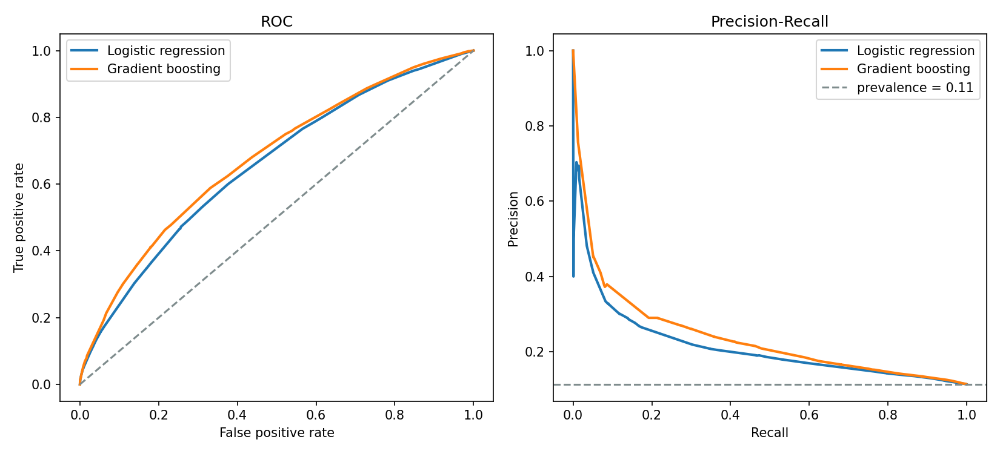
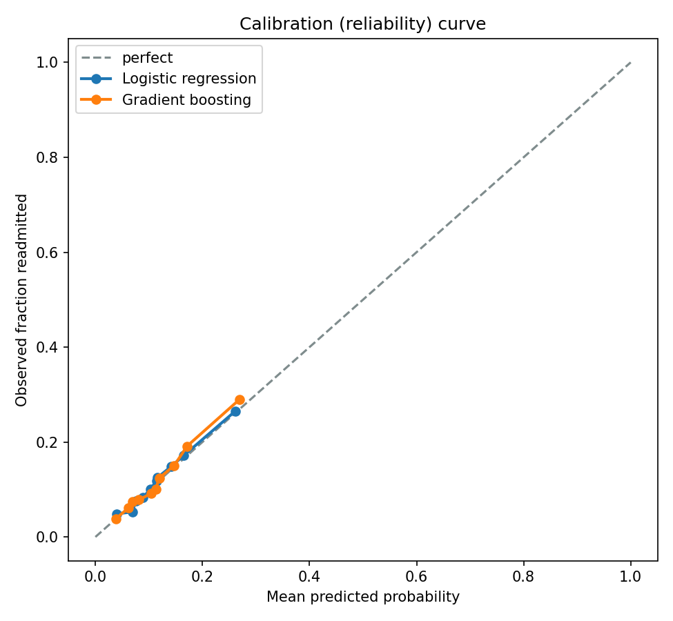
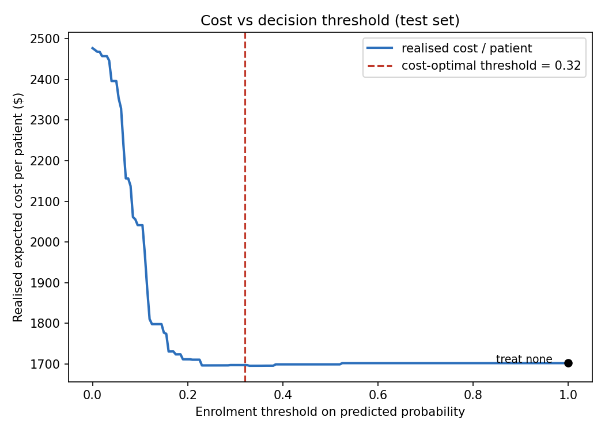

# Predicting 30-Day Hospital Readmission — with a Cost-Decision Layer

A patient-level machine-learning pipeline that predicts 30-day hospital
readmission for diabetic inpatients, then converts those predictions into a
**resource-allocation decision**: which patients should be offered a costly
preventive intervention, given the economics of doing so.

Dataset: *Diabetes 130-US hospitals, 1999–2008* (UCI, ~100k encounters, CC BY 4.0).

## Why this isn't another AUC-chasing classifier

Three things separate a useful clinical risk model from a leaderboard entry, and
this repo is built around all three:

1. **Patient-level split (no leakage).** The data has ~70k patients but ~100k
   encounters — the same patient recurs. A random row split leaks a patient into
   both train and test and inflates performance. We split by `patient_nbr` so no
   patient crosses the boundary (`GroupShuffleSplit`), and assert zero overlap.

2. **Calibration, not just discrimination.** A resource decision needs
   *probabilities you can trust*, not just a good ranking. We report the Brier
   score and a reliability curve, and isotonic-calibrate on a held-out slice.
   Miscalibrated probabilities would directly bias the cost estimates.

3. **A cost-sensitive decision threshold.** Instead of an arbitrary 0.5 cutoff,
   the enrolment threshold is derived from the economics. Enrol a patient when
   the expected saving beats the intervention cost:

   ```
   enrol if  p > C_intervention / (RRR · C_readmit)   :=  p*
   ```

   The optimal threshold is a **closed form** in the cost inputs. The model's job
   is purely to *target* — identify who clears `p*`.

## Results (real data, patient-level test set)

| Model               | ROC-AUC | PR-AUC | Brier |
|---------------------|--------:|-------:|------:|
| Logistic regression |   0.655 |  0.203 | 0.097 |
| Gradient boosting   |   0.676 |  0.221 | 0.096 |

ROC-AUC ~0.68 is consistent with the published difficulty of this task — 30-day
readmission is genuinely hard to predict from these features. A much higher
number on this dataset usually means a leaky split.




### The cost layer — and an honest finding

Illustrative economics: `C_readmit = $15,000`, `C_intervention = $1,200`,
`RRR = 0.25` → `p* = 0.32`.



The realised cost curve tells the important story:

- **Treat-everyone is disastrous** (~$2,475/patient): most enrolled patients were
  never going to be readmitted, so the program cost is wasted. Avoiding this is
  the single biggest financial win, and it needs a model.
- **Model-guided targeting reaches the minimum** (~$1,695/patient), and the
  closed-form `p* = 0.32` lands right in that flat minimum — theory and realised
  data agree.
- **But targeting only marginally beats doing nothing** (~$1,700/patient). With a
  hard-to-predict outcome, a low base rate (11%), and an intervention that is
  expensive relative to its effect, the model can confidently flag only a few
  patients, so the net gain over no-intervention is small (~$5k per 1,000).

That last point is the honest headline. **The value of the model here is mostly
in avoiding blanket intervention, not in beating inaction by a wide margin** — and
whether targeting beats inaction at all is highly sensitive to the (illustrative)
economic inputs. A portfolio version that reported a big "savings!" number would
be hiding this.

## Run it

```bash
pip install -r requirements.txt
python download_data.py     # -> data/diabetic_data.csv
python run_pipeline.py      # -> figures/ + results.json
```

## Layout

```
src/data_prep.py       # cleaning, ICD-9 grouping, feature eng, patient-level split
src/models.py          # LR baseline + HistGradientBoosting pipelines
src/cost_analysis.py   # closed-form threshold + policy comparison
src/plots.py           # ROC/PR, calibration, cost curve
run_pipeline.py        # end-to-end
download_data.py       # fetch dataset (CC BY 4.0)
```

## Limitations (read before quoting any number)

- **Economic inputs are illustrative.** `C_readmit`, `C_intervention` and `RRR`
  are placeholders. Real values must be sourced (reference costs; program
  budgets; an RCT/meta-analysis for the intervention effect).
- **Intervention effect is exogenous and assumed constant.** `RRR` cannot be
  estimated from this observational dataset — predicted risk is not the causal
  effect of the intervention. The cost model quantifies the value of *targeting*
  under assumed economics; it does not prove the intervention works.
- **Old, US-specific data (1999–2008).** ICD-9 coding, US care patterns; not
  transferable to current NHS practice without re-fitting.
- **Modest discrimination.** These structured features cap achievable AUC; richer
  clinical/temporal data would be needed to push it meaningfully higher.
- **No temporal validation possible** — the dataset carries no admission dates, so
  patient-grouped splitting is the available (and appropriate) safeguard.

## Reference

Strack et al. (2014), *Impact of HbA1c Measurement on Hospital Readmission Rates*,
BioMed Research International. Dataset via UCI ML Repository (id 296), CC BY 4.0.
